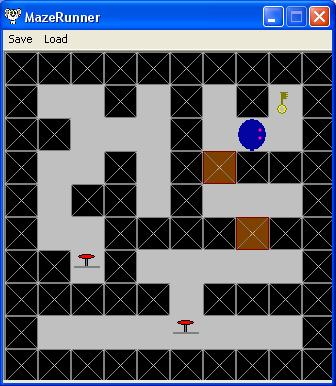



## Graphics Engine \- Easy to implement \- 2d

### Description

Easy-to-implement 2D tile Engine.

Included:

2D OCX

2D Editor

Maze Runner (a game in the making).

I appologise for not commenting this code very much. I a) only coded it yesterday and b) wasn't planning on uploading to PSC. If anyone understands and comments my code then could you please email me.
 
### More Info
 

             |
---                |---
**Submitted On**   |2002-10-12 19:54:14
**By**             |[John C\. H\. Fricker](https://github.com/Planet-Source-Code/PSCIndex/blob/master/ByAuthor/john-c-h-fricker.md)
**Level**          |Intermediate
**User Rating**    |4.9 (34 globes from 7 users)
**Compatibility**  |VB 3\.0, VB 4\.0 \(16\-bit\), VB 4\.0 \(32\-bit\), VB 5\.0, VB 6\.0
**Category**       |[Games](https://github.com/Planet-Source-Code/PSCIndex/blob/master/ByCategory/games__1-38.md)
**World**          |[Visual Basic](https://github.com/Planet-Source-Code/PSCIndex/blob/master/ByWorld/visual-basic.md)
**Archive File**   |[Graphics\_E14538410132002\.zip](https://github.com/Planet-Source-Code/john-c-h-fricker-graphics-engine-easy-to-implement-2d__1-39765/archive/master.zip)

